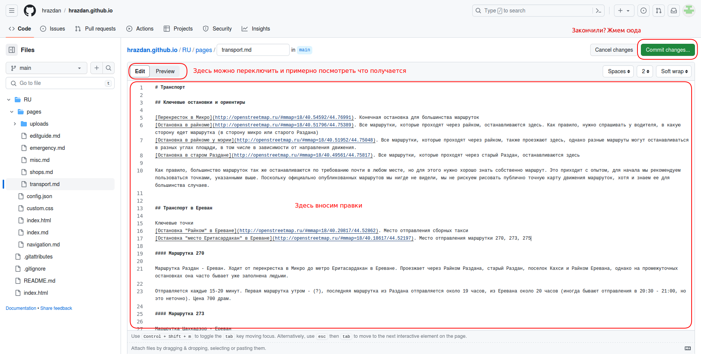

# Инструкция по редактированию

## Общие положения

Настоящий справочник открыт для внесения изменений и редактирований всеми желающими, однако на данный момент все изменения проходят предварительную проверку. Кроме того, для внесения изменений нужен аккаунт на https://github.com

Справочник сделан на основе [Github Pages](https://pages.github.com/) - инструмент, который позволяет из репозитория со статичными страницами (html+js+css) сделать веб-сайт. Кроме того, мы используем движок http://mdwiki.info - это скрипт, который делает полноценный веб-сайт из набора [файлов ․md](https://en.wikipedia.org/wiki/Markdown)

Администратор и техподдержка [Владимир Шалимов](https://t.me/PVoLan), [чат Раздана](https://t.me/hrazdan_team) 

## Инструкция для ИТ-шников

Заходим в репозиторий https://github.com/hrazdan/hrazdan.github.io, клонируем, делаем правки, коммитим, делаем pull request. Альтернативно, просим у кого-то из админов доступ в репозиторий напрямую и коммитим прямо в репозиторий. Github Pages обновляет сайт автоматически через 5-10 минут после коммита в main

Краткая структура репозитория:

`/RU/index.md` - главная страница  
`/RU/navigation.md` - главное меню и ряд глобальных настроек

`/RU/pages/*.md` - страницы справочника по разделам  
`/RU/pages/uploads` - место для файликов (картинок и т.п.). У Github Pages довольно строгие [лимиты](https://docs.github.com/en/pages/getting-started-with-github-pages/about-github-pages#limits-on-use-of-github-pages), поэтому файлики не следует загружать без необходимости, предпочтительно использовать текст или внешние хранилища для файлов. Картинки следует сжимать до разумного размера.

Справочно (эти файлы не нужно изменять, если вы не знаете на 100% что делаете):

`/RU/index.html`  
`/RU/custom.css`  
`/RU/config.json` - собственно движок, который генерирует HTML из файлов Markdown

`/index.html` - корневой index.html, который просто редиректит на русскую версию справочника. В будущем возможно добавление версий на других языках путем копирования (и перевода) папки RU, например, в папку AM

Склонированный репозиторий потенциально можно без труда разместить на любом другом хостинге, что будет полезно для потомков и в случае аварий

См. также файл README в корне репозитория

## Инструкция для не ИТ-шников

К сожалению, не ИТ-шникам скорее всего пока будут доступны только небольшие правки. Возможно, впоследствии мы придумаем, как усовершенствовать механизм правок, но пока вот так.

* **Зарегистрируйтесь на https://github.com**

* **<s>Поздравляю, теперь вы - ИТ-шник</s>**  
_Еще нет, но вы уже на пути в светлое будущее (=_

* **Заходим сюда https://github.com/hrazdan/hrazdan.github.io/tree/main/RU/pages**

* **Каждый из файлов в списке соответствует одной из страниц справочника. Например, мы хотим отредактировать раздел "Транспорт"**

* **Жмем на карандашик**

* **При первой правке вас попросят "сфоркать репозиторий". Жмем большую зеленую кнопку.**  
_Для любознательных: "сфоркать репозиторий" в переводе на русский это значит "сделать полную копию справочника на вашем аккаунте github". Механизм такой - вы делаете полную копию справочника "у себя", делаете в ней правки какие считаете нужными, потом **предлагаете** ваши изменения на утверждение в <s>основной репозиторий</s> основную версию справочника. Из плюсов этого довольно замысловатого подхода - у вас нет никаких шансов поломать справочник до тех пор, пока кто-нибудь из администраторов не утвердит ваши правки. Так что можете смело переписывать все, что считаете нужным._

* **Вносим правки**  
Используется разметка Markdown. [Краткое руководство на русском](https://gist.github.com/Jekins/2bf2d0638163f1294637). [Подробное руководство на английском](https://www.markdownguide.org/basic-syntax/).  
Превью на github и реальная разметка на сайте справочника могут незначительно отличаться, это нормально.  
Для начала ограничьтесь небольшими правками. Будет обидно потерять сразу большое количество изменений, если что-то пойдет не так, верно?  
Кроме того, если случится так, что кто-то другой будет одновременно делать правки в том же месте, что и вы, есть риск попасть в неудобное положение (которое ИТ-шники называют конфликтом изменений)

* **Коммитим (то есть сохраняем) правки**  
При сохранении, пожалуйста, опишите _вкратце_ суть ваших правок, чтобы администратору было легче понять смысл вашего творчества

* **Создаем пулл-реквест из ваших правок**  
Жмем зеленую кнопку  
_Для любознательных: ваши правки сохранены, но пока только в вашей копии справочника. Теперь нужно отправить запрос администраторам основного справочника на прием ваших правок - это называется пулл-реквест. Почему для этого нужна отдельная кнопка? Дело в том, что теоретически пулл-реквест может состоять из нескольких коммитов (сохранений) - например, вы можете сделать правки сразу в нескольких файлах в несколько подходов, и потом отправить на утверждение все изменения за раз. Однако, это уже продвинутый уровень использования github, который мы оставляем вам на самостоятельное изучение_

* **Отправляем пулл-реквест на одобрение**  
Корректируем комментарий для администратора (при желании) и жмем зеленую кнопку  

* **Вы восхитительны! Администратор получит оповещение о ваших правках, проверит их и утвердит**  
